# Top 30 Best Chatbot and Messenger Marketing Tools in 2025

Tired of manually replying to the same Instagram DMs over and over, or watching potential customers slip away because you can't respond fast enough on WhatsApp? You're stuck in a time-consuming loop where every message needs a personal touch, but there just aren't enough hours in the day. The right chatbot platform can flip this situation completely—automating your busiest conversations while keeping that human feel your audience expects. These tools handle everything from Facebook Messenger campaigns to Instagram comment automation, letting you focus on strategy instead of typing the same replies a hundred times.

## **[ManyChat](https://manychat.com)**

The undisputed leader for social media automation, built specifically for businesses that live on Instagram, Facebook Messenger, and WhatsApp.

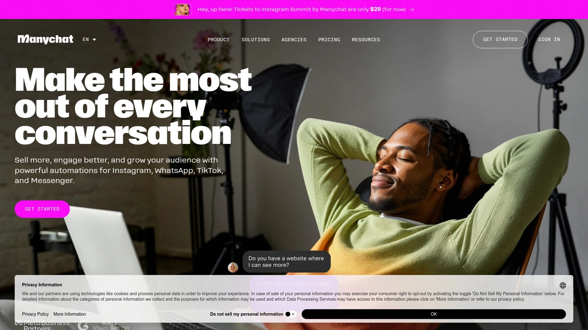

ManyChat transformed messenger marketing when it launched back in 2015, and it's still the platform most marketers reach for first. The visual automation builder makes it stupid easy to create flows—most people are up and running within minutes, no coding knowledge required. You can trigger automations from Instagram comments, story replies, or direct messages, which is massive for turning engagement into actual conversations. The platform supports all three Meta channels plus SMS, giving you flexibility to meet customers wherever they hang out. AI features include keyword recognition, intent detection, and an AI Flow Builder Assistant that can auto-generate entire conversation sequences based on your goals. The free plan covers basic automation with limitations, while Pro plans start at $15 monthly and unlock advanced features like unlimited custom fields, priority support, and removal of ManyChat branding. What makes ManyChat special is how it balances power with simplicity—you can build sophisticated multi-step funnels with conditions and variables, or use Quick Automations that walk you through setup step-by-step. Live chat handoff lets humans jump in when needed, and the contact management system automatically tags and segments your audience based on their interactions. Success rates for messenger marketing campaigns regularly hit 80% open rates and 56% click-through rates, crushing traditional email's 20% open rate.

## **[Chatfuel](https://chatfuel.com)**

A powerful multi-platform chatbot builder with advanced AI capabilities and a client roster including Adidas and Netflix.

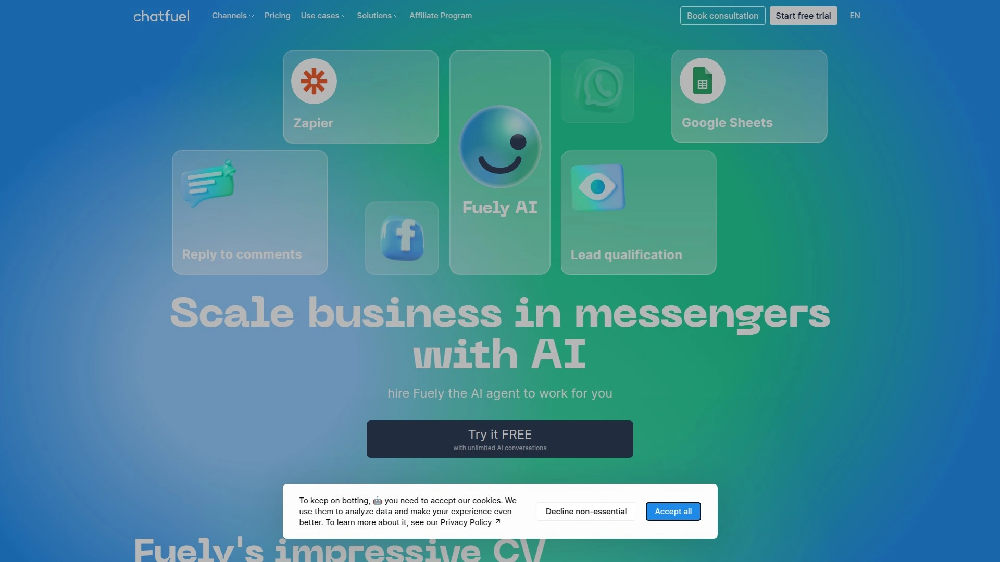

Chatfuel excels with its sophisticated AI that enables more natural conversations than most competitors. The platform supports Facebook Messenger, Instagram, and WhatsApp with robust analytics dashboards and A/B testing functionality built right in. The visual flow builder uses a card-based system that's intuitive once you get past the initial learning curve. Free plans are available just like ManyChat, with Pro plans starting around $15 monthly. What sets Chatfuel apart is extensive data collection capabilities—you can gather detailed customer information through conversations and sync it with your CRM. The built-in live chat includes mobile apps so your team can respond from anywhere. Chatfuel provides free templates covering welcome messages and FAQ automation, plus you can create custom templates to reuse across multiple bots. The platform handles customer service particularly well, with smart routing that directs complex issues to human agents automatically. Integration options include major platforms though not quite as extensive as some competitors. Best suited for businesses that need powerful data collection and don't mind investing time upfront to master the more technical aspects.

## **[Tidio](https://tidio.com)**

An all-in-one customer communication platform combining live chat, AI chatbots, and help desk features, with a focus on website engagement.

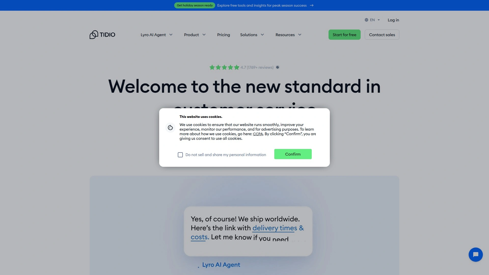

Tidio specializes in website-based communication with customizable chat widgets and visitor tracking tools. Their AI chatbot Lyro uses natural language processing to understand context and handle complex conversations, though you can't currently use Lyro AI together with custom flows. The flow builder is very easy to use with great features including user input collection, conditional logic, and button elements. Five channels are supported including website, Facebook, Instagram, WhatsApp, and email. The free plan includes 50 live chat conversations, 50 Lyro conversations, and reaches up to 500 emails monthly. Paid plans start at $29 monthly with separate use cases you can combine. Growth tools include proactive website messages and customizable widgets. Advanced analytics become available on higher-tier plans with four dashboards for chatbot analysis and custom triggers to track specific actions. Up to 50 direct integrations include Zapier for connecting virtually any other tool. Tidio won AI Company of the Year at the Global Business Tech Awards 2025, showing industry recognition. The platform achieved an 89% resolution rate for one client using Lyro AI. Best for small to medium businesses wanting affordable all-in-one communication software that prioritizes website visitors over social media channels.

## **[Intercom](https://intercom.com)**

Enterprise-grade customer messaging platform with sophisticated AI features and comprehensive tools for both support and marketing teams.

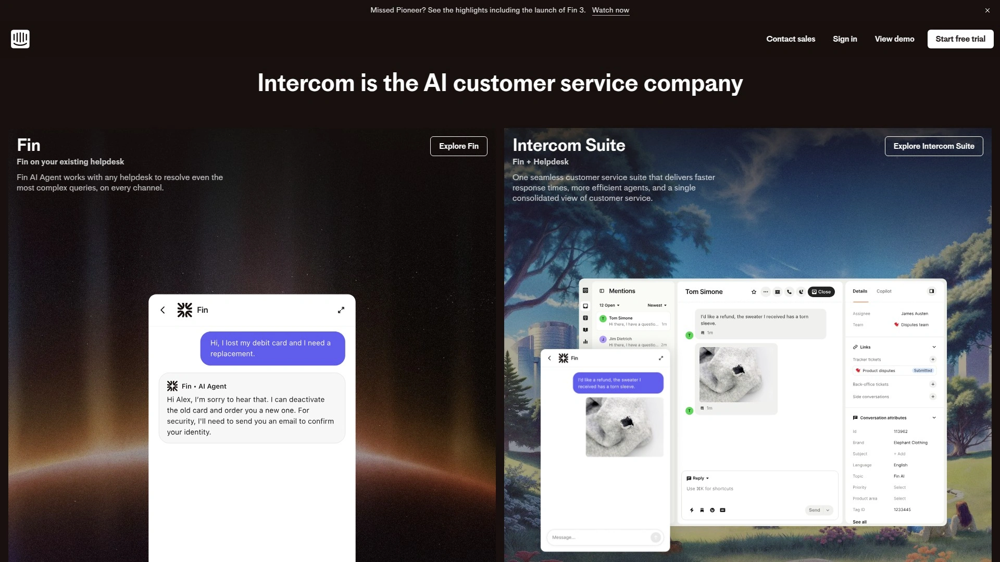

Intercom functions as a complete customer communication infrastructure with advanced features unavailable in budget tools. The AI-powered chatbot Fin can suggest help center articles based on user input, collect contextual information, and route conversations intelligently. You can trigger messages based on in-app behavior, making it valuable for SaaS companies handling onboarding and proactive support. Notable customers include Amazon, Meta, and Atlassian. The platform won Momentum and Implementation Leader awards in 2025 from G2. Intercom offers six channels including website, Facebook, Instagram, WhatsApp, SMS, and email. Growth tools are extensive with broadcasts, sequences, rules, advanced website widgets, proactive messages, posts, tours, banners, and series. Analytics are extremely comprehensive with custom workflow automations, resolution flow tracking, and custom report building. The app marketplace includes hundreds of integrations across support, CRM, analytics, and product management categories. Pricing starts at $39 per agent monthly, though accessing all features requires the higher $99 per agent tier. All plans include 14-day free trials. The main downside is cost—smaller teams may struggle with the investment, but enterprise organizations get tremendous value from the depth of functionality.

## **[Botpress](https://botpress.com)**

Open-source chatbot powerhouse providing maximum flexibility and control, ideal for technical teams building custom solutions.

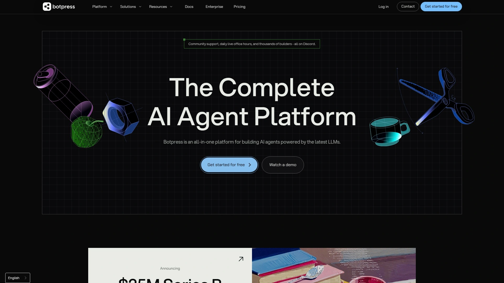

Botpress offers unparalleled customization through its open-source core, allowing complete access to the codebase. The platform includes both a visual flow builder and code editor for complex projects. Advanced natural language processing features enable sophisticated conversation handling. You can extend functionality with custom modules tailored to specific business needs. The free plan includes up to 2,000 messages monthly, with paid plans starting at just $1 monthly and scaling up to $495 for the Team plan with 20 bots and 250,000 inquiries. Pay-as-you-go pricing accommodates businesses with fluctuating chatbot needs. Enterprise plans offer custom solutions for large organizations. Over 50 direct integrations make connecting to existing systems straightforward. The visual builder suits both visual and code-based users. The major trade-off is technical expertise—while Botpress provides visual tools, maximizing the platform often involves coding. This makes it perfect for businesses with developer resources who want complete infrastructure control. If you're willing to invest time and resources into a truly custom solution, Botpress provides the foundation you need. Rated 4.1 out of 5 stars with recognition as a top platform for advanced AI support chatbots.

## **[Voiceflow](https://voiceflow.com)**

No-code chatbot builder emphasizing simplicity with drag-and-drop interface, perfect for teams without technical backgrounds.

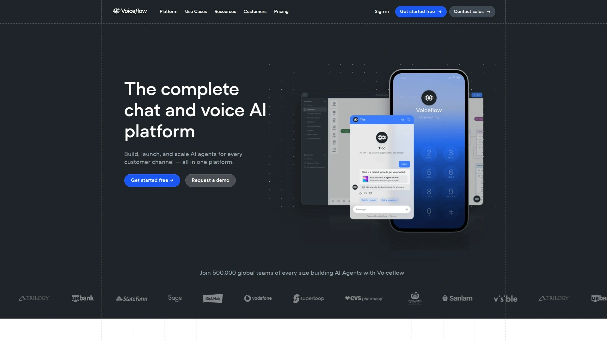

Voiceflow focuses on making chatbot creation accessible to non-developers through an intuitive visual interface. The platform excels at building both voice and chatbots quickly with less technical setup than alternatives. Built-in templates accelerate deployment and team collaboration. Vision Agent and Knowledge Agent tools enhance conversational capabilities. The free plan includes 50 knowledge sources, 2 agents, and up to 100K monthly AI tokens. Paid plans start at $50 monthly and range up to $625 based on your feature needs. Token-based pricing allows scaling as your chatbot usage grows. Third-party platform integrations use APIs, though the range isn't as extensive as some competitors. Voiceflow is particularly strong for voice-driven projects. The drag-and-drop interface makes building chatbot flows feel natural even for complete beginners. ManyChat achieved an 80% open rate according to Mikael Yang, while Voiceflow emphasizes rapid deployment speed. Rated 4.2 out of 5 stars as one of the best platforms for AI chatbots on websites. Best suited for teams prioritizing ease of use over deep technical customization, or businesses that need to get chatbots running quickly without extensive training.

## **[Freshchat](https://freshworks.com/live-chat-software/)**

Messaging software from Freshworks supporting multiple channels with strong focus on team collaboration and affordable pricing.

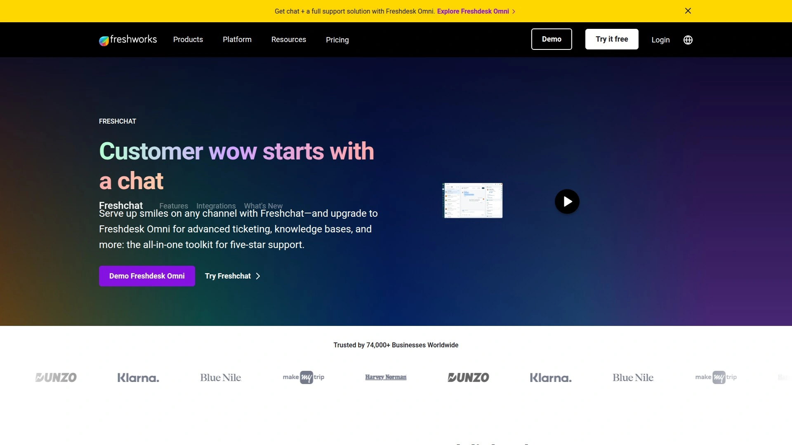

Freshchat enables communication across messaging platforms with robust team management features. Notable customers include Klarna, Blue Nile, and Dunzo. The platform won TrustRadius Best of awards in multiple categories in 2022. Free plans are available, with paid plans starting around $15 per agent monthly. The pricing makes it one of the most affordable solutions for large customer support teams. Chat functionality works across multiple channels beyond just websites. The interface emphasizes making customer conversations easy for support teams to manage collaboratively. Integration capabilities connect with popular helpdesk and business tools. Freshchat positions itself as a more budget-friendly alternative to enterprise platforms while still delivering professional features. The platform balances cost with functionality well for medium-sized businesses. Analytics and reporting help teams track performance and identify improvement areas. Automation features handle routine inquiries so human agents focus on complex issues. Best for growing support teams that need multi-channel messaging without enterprise software costs.

## **[Drift](https://drift.com)**

Conversational marketing and sales acceleration platform using chatbots and live chat to engage customers and convert leads.

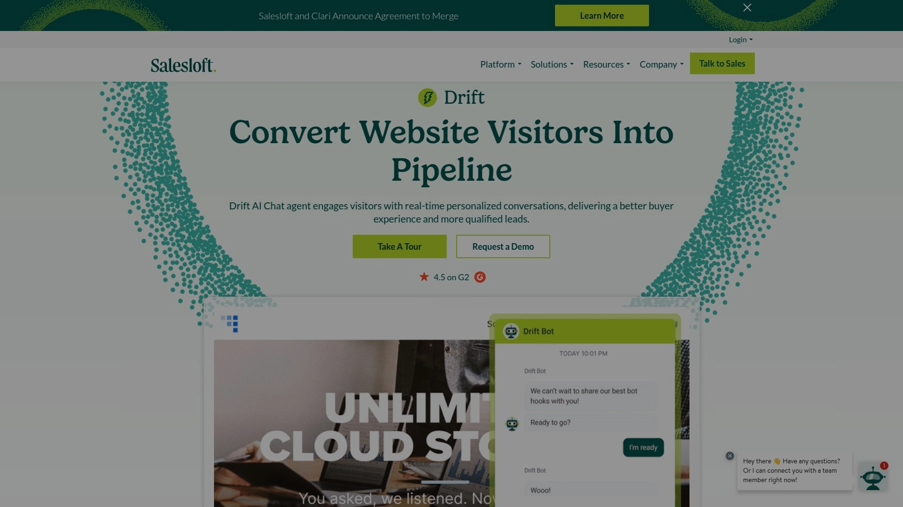

Drift focuses specifically on revenue generation rather than support, making it unique in this space. The platform uses chatbots and live chat to facilitate real-time communication and push leads down the sales funnel. Drift Deal Room creates consolidated sales reports in shared spaces for companies and customers. While it works similarly to a CRM, it doesn't include the full feature set of dedicated CRM platforms. Notable customers include State Street, SAP Concur, and Okta. The platform ranked in the Top 50 Analytics and AI Products by G2 in 2023. Playbooks let you create chat flows responding to different scenarios like returning visitors or pricing page viewers. Chatbots can qualify visitors by asking pre-set questions, then schedule meetings with your sales team automatically. Key integrations include Salesforce, Marketo, and Outreach for managing leads and tracking engagement. Pricing requires contacting Drift for custom quotes on Premium, Advanced, and Enterprise tiers. A demo is available to test functionality. Features include chat widgets, routing, mobile apps, lead qualification, data tracking, personalized playbooks, A/B testing, and custom security. The main limitation is that useful features concentrate in higher-priced tiers, potentially stretching smaller company budgets. Best for B2B companies with longer sales cycles that need sophisticated lead qualification and meeting scheduling automation.

## **[Zendesk](https://zendesk.com)**

Comprehensive customer support platform with robust ticketing, live chat, and multi-channel management for high-volume teams.

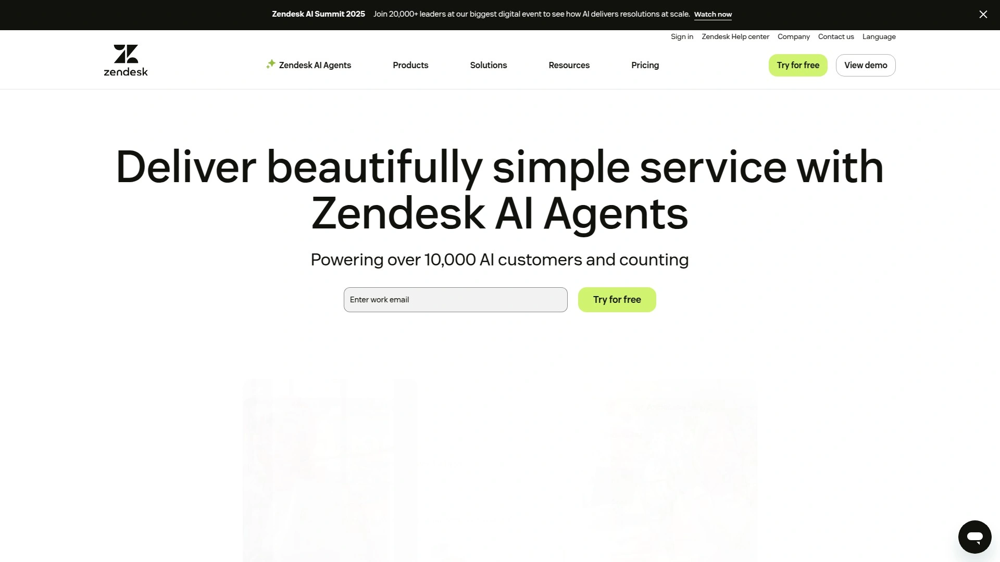

Zendesk functions primarily as a customer support powerhouse enabling businesses to manage queries through email, chat, social media, and more. The focus centers on ticketing systems and tracking customer requests rather than conversational marketing. Extensive customization options give teams flexibility, though this creates a learning curve. Broad support options and analytics help teams handling high inquiry volumes. Tiered pricing plans accommodate various business sizes and needs. Major customers rely on Zendesk for its proven enterprise-scale reliability. Live chat capabilities integrate with the broader support ecosystem. Chatbot automation can deflect routine inquiries before they reach human agents. The platform excels at reporting and team performance tracking. Integration marketplace connects virtually any business software. Zendesk makes sense when you need industrial-strength support infrastructure beyond just chat. The system handles complex ticket routing, SLA management, and multi-brand support. Best for medium to large businesses managing substantial support volumes across multiple channels who need proven, reliable software that scales.

## **[LiveChat](https://livechat.com)**

Pure live chat solution with strong customization, reliability, and focus on real-time website visitor engagement.

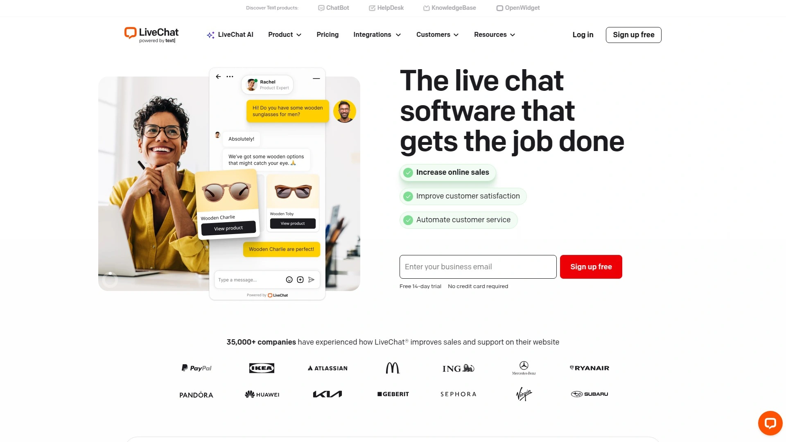

LiveChat specializes exclusively in live chat rather than trying to be everything to everyone. This narrow focus results in exceptional performance for its core functionality. The platform achieves excellent reliability with consistent uptime. Customization options let you tailor the chat experience to match your brand perfectly. Real-time visitor monitoring shows who's on your site and what they're viewing, enabling proactive chat invitations. Automation features handle common questions while routing complex issues to appropriate agents. The Co-Pilot feature assists agents with suggested responses and relevant information. Mobile apps keep your team connected even when away from desks. Detailed analytics track chat volume, response times, customer satisfaction, and agent performance. Integration library connects CRM, helpdesk, e-commerce, and marketing automation platforms. Pricing reflects the premium positioning with professional-grade features. Best for businesses wanting a dedicated, reliable live chat solution rather than an all-in-one platform. Works particularly well for e-commerce and service businesses where immediate website visitor engagement drives conversions. The specialization means you get depth rather than breadth of features.

## **[HubSpot Chatbot Builder](https://hubspot.com)**

Marketing, sales, and CRM suite with integrated chatbot functionality, perfect for businesses already using HubSpot ecosystem.

HubSpot's chatbot builder integrates seamlessly with the broader HubSpot platform for unified customer data. If you already use HubSpot CRM, the chatbot becomes incredibly powerful by leveraging existing contact information. The visual flow builder follows HubSpot's signature ease-of-use philosophy. Chatbots can qualify leads, book meetings, and route conversations based on contact properties. Automation triggers based on website behavior, contact attributes, and lifecycle stages. The free tier includes basic chatbot functionality, making it accessible for small businesses. Paid plans unlock advanced features and scale with your contact database. Integration with HubSpot's marketing tools enables sophisticated campaigns combining email, chat, and social media. Reporting shows chatbot performance alongside other marketing channels for holistic analytics. The main limitation is that you're somewhat locked into the HubSpot ecosystem. Best for businesses already committed to HubSpot who want chatbots that share data with their marketing and sales tools seamlessly. The unified platform eliminates data silos and creates smooth customer experiences. Works particularly well for inbound marketing strategies where chatbots nurture leads captured through content.

## **[Gorgias](https://gorgias.com)**

Help desk software designed specifically for e-commerce businesses, providing multi-channel support and automation.

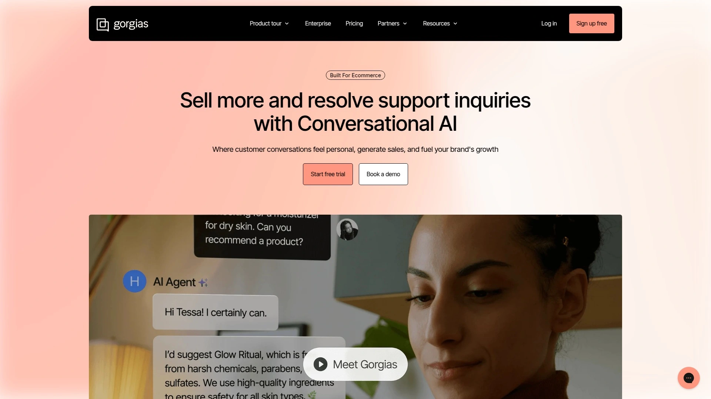

Gorgias targets online stores with features tailored to e-commerce customer service needs. Multi-channel support handles inquiries from email, chat, social media, SMS, and phone in one interface. Strong automation features streamline repetitive tasks and improve team efficiency. Social media integrations enhance customer interactions across platforms. The user-friendly interface makes onboarding straightforward for support teams. Revenue-focused features show how support interactions impact sales. Shopify integration is particularly tight, pulling order information directly into conversations. Macros and automation rules handle common questions about shipping, returns, and product details. Live chat widgets match your store branding for consistent customer experience. The platform understands e-commerce metrics like CSAT, revenue per ticket, and conversion rates. Initial setup and customization can feel complex despite the intuitive interface. Email notification options are somewhat limited. Best for Shopify and e-commerce businesses that need support software understanding online retail specifically rather than generic helpdesk tools. The commerce-focused approach means features align with what online sellers actually need daily.

## **[Birdeye](https://birdeye.com)**

Multi-channel communication platform emphasizing reputation management, reviews, and customer feedback collection.

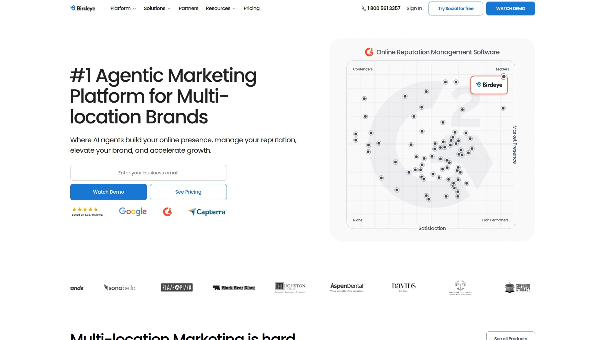

Birdeye combines messaging with reputation management in a unique approach. The platform helps businesses collect and manage reviews across Google, Facebook, and 150+ other sites. Automated SMS and email review requests integrate with HubSpot and other CRMs. Customer communication happens via webchat, SMS, and messaging apps. Notable customers include RingCentral, Aspen Dental, and Bekins. Birdeye won #1 ranking in 97 categories with 219 badges at G2 Summer 2024. Standard plans start at $299 monthly, with Professional tier at $399 including Messenger and Webchat features. Real-time analytics empower businesses to monitor conversation trends and customer sentiments. The integration with HubSpot syncs contacts automatically to streamline review collection. Marketing tools let you promote positive reviews to websites, blogs, social channels, and search engines. A steady flow of new reviews improves local search rankings so customers choose you over competitors. The platform handles review response management, letting you instantly address negative feedback. Best for service businesses, healthcare providers, and local companies where online reputation directly impacts customer acquisition. The combination of communication and reputation management solves two problems in one platform.

## **[UChat](https://uchat.com.au)**

Omnichannel chatbot platform for small and medium businesses wanting flexibility across multiple channels.

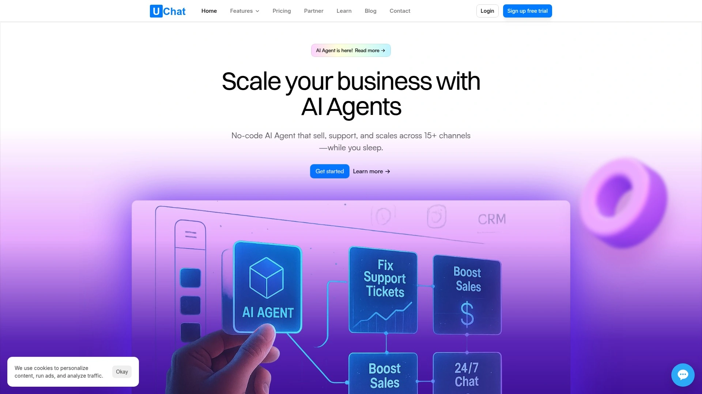

UChat provides chatbot functionality across numerous channels from a single platform. The visual flow builder accommodates various skill levels from beginners to advanced users. Free plans let you test the platform, with premium plans starting at $15 monthly. Multi-channel support covers website, Facebook, Instagram, WhatsApp, Telegram, SMS, and more. Conditions and variables enable sophisticated conversation logic. E-commerce integrations connect with Shopify and WooCommerce for product catalogs and order status. The platform emphasizes making omnichannel bots accessible to smaller businesses without enterprise budgets. Drag-and-drop interface simplifies flow creation while still offering power user features. API connections extend functionality to custom systems. Rated 4.5 out of 5 stars showing strong user satisfaction. Best for small to medium businesses that need chatbots across multiple platforms but can't afford enterprise solutions. The balance of features, channels, and price makes it practical for growing companies.

## **[Recart](https://recart.com)**

Messenger and SMS marketing platform built specifically for Shopify stores and e-commerce businesses.

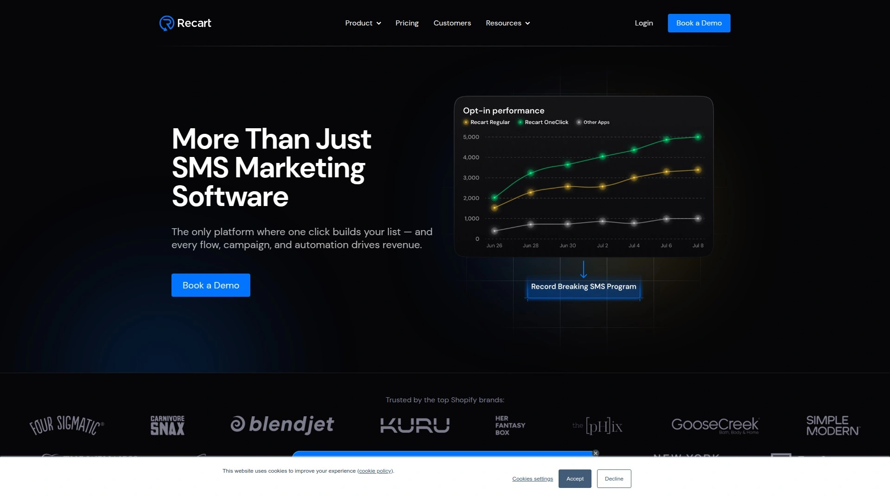

Recart pioneered messenger marketing for e-commerce and remains one of the most popular Shopify apps. The platform specializes in abandoned cart recovery, post-purchase follow-ups, and promotional campaigns via Messenger and SMS. Built-in quiz tool drives traffic and drastically increases engagement and conversions. Data shows merchants typically see 8-14% revenue increases after optimizing Recart campaigns. Template library accelerates setup with proven e-commerce flows. Dynamic discount codes personalize offers for each customer. Smart pop-up tools collect Messenger subscribers directly on your website. Integration with Facebook's Click to Messenger and Sponsored Message campaigns extends reach. The platform understands e-commerce metrics like cart abandonment, customer lifetime value, and purchase frequency. Automation handles welcome messages, shipping updates, and win-back campaigns. Analytics track campaign performance with revenue attribution. Best for Shopify merchants and e-commerce businesses focused on conversational commerce through Messenger and SMS. The e-commerce specialization means every feature directly serves online store needs.

## **[Customers.ai](https://customers.ai)**

Formerly Mobile Monkey, this platform focuses on multi-channel customer engagement through Instagram, Facebook, and SMS.

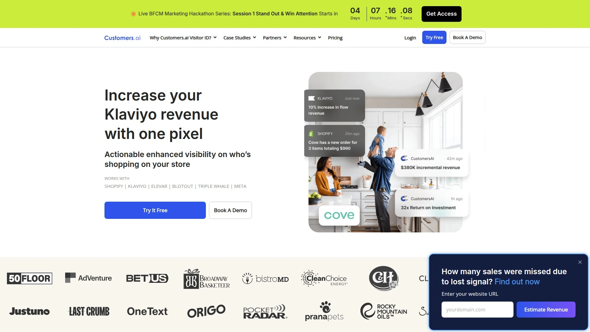

Customers.ai rebranded from MobileMonkey to reflect expanded capabilities beyond just mobile messaging. The platform handles Instagram DM automation, Facebook Messenger marketing, and SMS campaigns. Multi-channel approach lets businesses meet customers on their preferred platforms. Automation workflows trigger based on customer behavior and engagement. Lead capture tools convert social media followers into subscribers. The platform emphasizes growing contact lists that you own rather than relying on platform algorithms. Integration with Facebook Ads connects paid campaigns to automated follow-ups. Analytics show subscriber growth, message engagement, and conversion rates. Best for marketers running social media campaigns who need automation connecting ads to conversations. The rebrand signals evolution toward comprehensive customer engagement across channels.

## **[Landbot](https://landbot.io)**

No-code conversational interface builder focusing on engagement through interactive conversations on websites and apps.

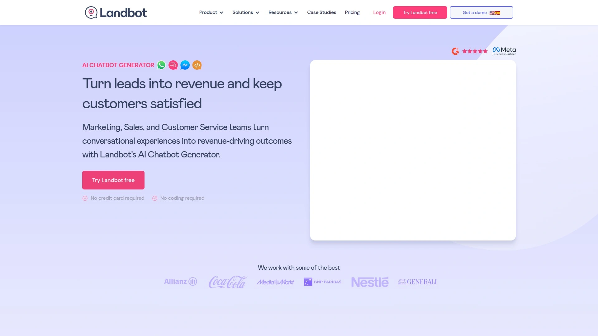

Landbot emphasizes creating conversation-driven experiences that engage visitors and improve user experience. The visual builder uses pre-built conversational elements called "bricks" to speed up creation. Drag-and-drop interface makes flow construction hassle-free. Multi-platform compatibility deploys chatbots on WhatsApp, Facebook Messenger, and websites. Webhooks and APIs integrate with external systems and data sources. The free plan allows up to 100 chats monthly, with paid plans starting at €30 monthly. Conversational approach feels more engaging than traditional forms. The platform lacks the AI sophistication of more advanced builders. Customization options don't match some competitors. Best for businesses wanting to replace static website forms with interactive conversations. The conversational UI increases completion rates compared to traditional forms. Works well for lead generation, qualification, and appointment booking.

## **[Botsonic](https://writesonic.com/botsonic)**

No-code AI chatbot builder powered by GPT-4, enabling custom ChatGPT-like experiences trained on your data.

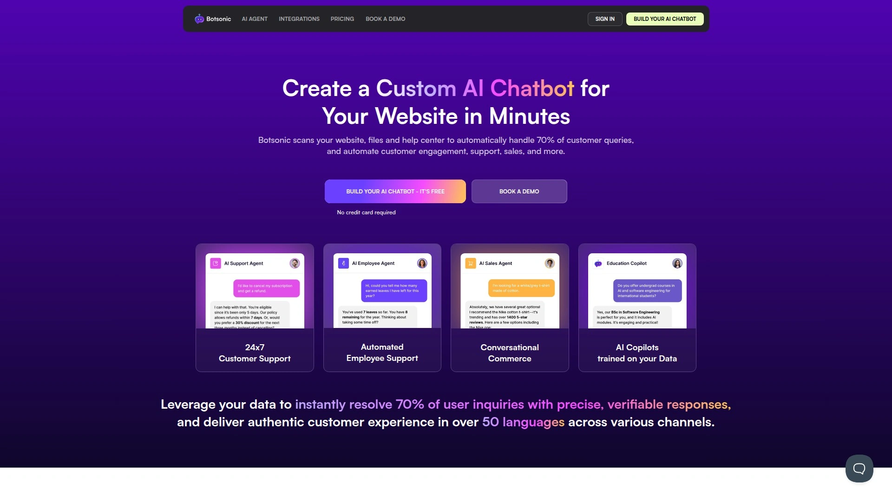

Botsonic uses GPT-4, the most advanced language model, to create intelligent chatbots. You can train the AI on your own data including documents, websites, and knowledge bases. The drag-and-drop interface makes setup straightforward even without technical skills. Custom branding options include name, colors, tagline, welcome message, logo, and icon. Built-in safeguards ensure the bot stays on topic using only your content to answer questions. Seamless integrations connect via embedded scripts or API keys. The platform focuses on accuracy and trustworthiness by restricting responses to trained data. E-commerce connections work with Shopify for product information. Best for businesses wanting ChatGPT-style conversational AI without the risk of hallucinations or off-topic responses. The GPT-4 foundation provides advanced language understanding while your training data keeps answers reliable. Works well for customer support, website engagement, and lead generation.

## **[Chatbase](https://chatbase.co)**

AI chatbot platform that creates ChatGPT-like bots trained on your website, documents, and data sources.

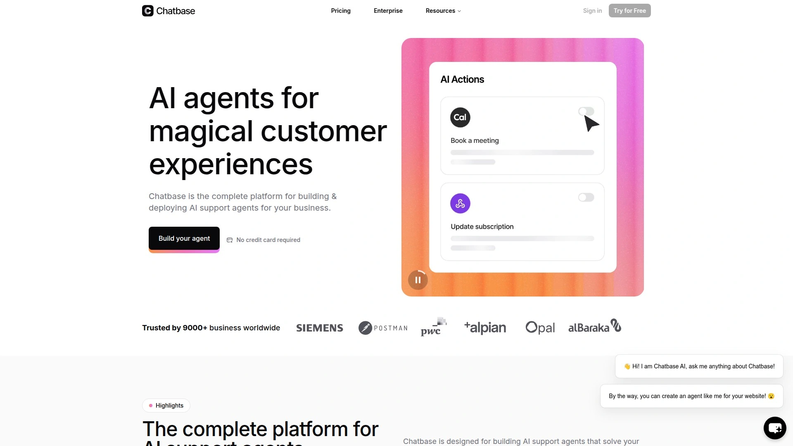

Chatbase lets you upload multiple file types including PDFs, websites, images, and videos to train your chatbot. The free plan includes 1 chatbot and 30 message credits monthly, with paid plans starting at $19 for the Hobby tier. Standard plan at $99 monthly provides 5 chatbots and 10,000 message credits. Customization options cover brand colors, welcome messages, input placeholders, and launcher icons. The platform supports removing branding, custom domains, and custom CSS for full appearance control. Conversation history logs all interactions for review and improvement. Analytics track chatbot usage and performance metrics. Lead capture collects visitor email addresses through conversations. Human handover and escalation features route complex issues to your team. Multi-language support enables global deployment. Integration options include Slack, Telegram, WhatsApp, Zapier, Facebook Messenger, and more. Training on multiple data sources creates comprehensive knowledge bases. Rated 4.1 out of 5 stars as a top choice for AI beginners. Best for businesses wanting quick chatbot deployment using existing content without extensive configuration.

## **[Dante AI](https://dante-ai.com)**

AI chatbot builder empowering businesses to create custom chatbots trained on proprietary data for enhanced engagement.

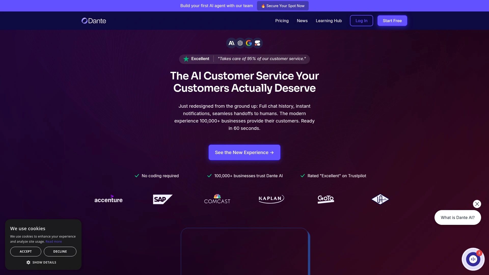

Dante enables speaking to your chatbot instead of typing, with voice responses. Upload files including PDFs and DOCX to train on your content. Website URL training pulls information from your entire site. Simple text, YouTube videos, Notion, Google Drive, and Dropbox connections expand training sources. Pricing starts at $30 monthly for the Entry plan with 3 chatbots and 2000 message credits. Professional tier at $300 monthly offers 10 chatbots and 20,000 credits. Customization includes personality traits, names, and instructions for creative responses. Security prioritizes data protection with encrypted AWS storage. Share chatbots with friends, embed in websites, or add chat bubbles with single clicks. API access enables programmatic integration. The platform emphasizes making AI chatbot creation accessible while maintaining security. Best for businesses wanting personality-driven chatbots that feel unique and engaging. The voice capabilities differentiate it from text-only platforms.

## **[Kommunicate](https://kommunicate.io)**

Customer service automation platform combining live chat, chatbots, and human support in unified interface.

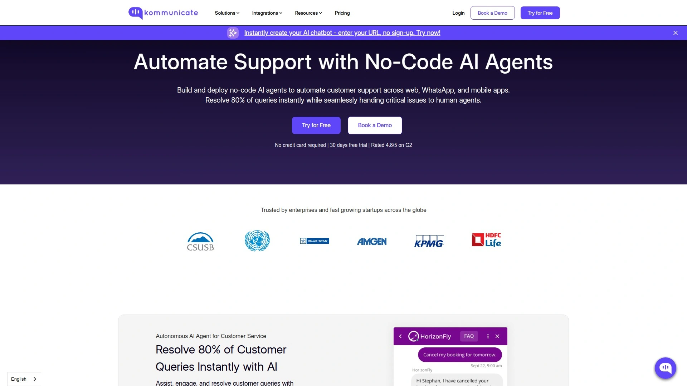

Kommunicate focuses on customer service scenarios where automation and human agents work together. The hybrid approach lets bots handle routine questions while seamlessly handing complex issues to humans. Multi-channel support covers website chat, mobile apps, and messaging platforms. Visual bot builder requires no coding for conversation flow creation. Pre-built templates accelerate deployment for common customer service scenarios. Integration with helpdesk platforms centralizes ticket management. Analytics track bot performance, customer satisfaction, and resolution rates. The platform emphasizes improving customer service efficiency without sacrificing quality. Pricing tiers accommodate businesses from small teams to enterprises. Best for customer service teams wanting automation that enhances rather than replaces human support. The focus on seamless handoffs ensures customers never feel stuck with an unhelpful bot.

## **[Ada](https://ada.cx)**

AI-powered customer service automation platform designed to enhance experiences by automating interactions across channels.

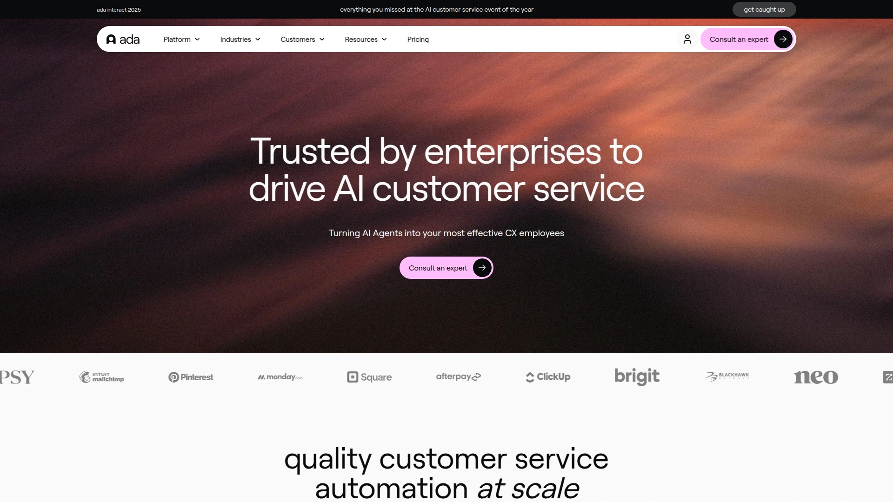

Ada serves major brands including Canva, Pinterest, Mailchimp, and Air Asia. Founded in 2016 and headquartered in Toronto, the platform targets ecommerce, fintech, SaaS, media, telecom, banking, insurance, retail, travel, and education industries. Rated 4.6 stars on G2 showing strong user satisfaction. The code-free platform creates multilingual chatbots with dedicated account management. Simple UI makes setup straightforward while offering deep customization. Multi-channel deployment covers web, SMS, email, social media, and voice. Integration with major CRM and support tools includes Zendesk, Salesforce, and HubSpot. Customization spans branding to conversation flows for business-specific needs. The platform focuses on streamlining customer support operations and reducing human agent workload. Pricing requires contacting the team for custom quotes. No free trial is available. Some users report customization limits and lack of chatbot templates. Best for enterprises needing sophisticated customer service automation with proven reliability at scale.

## **[SendPulse](https://sendpulse.com)**

Multi-channel marketing automation platform combining email, SMS, web push, and chatbot functionality.

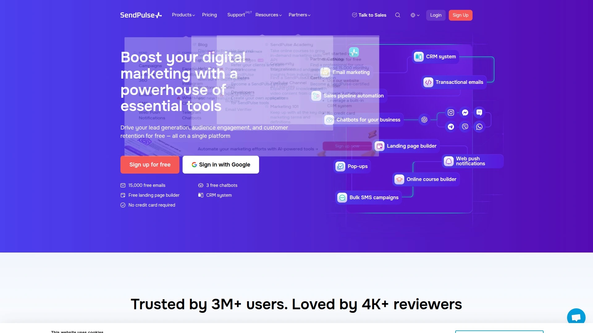

SendPulse provides marketing tools beyond just chatbots including email campaigns, SMS marketing, and web push notifications. The platform positions as an affordable all-in-one marketing solution. Chatbot builder supports Facebook Messenger, WhatsApp, Telegram, and Instagram. Visual flow builder creates automated conversation sequences. Subscriber management organizes contacts and segments audiences. E-commerce features include product catalogs and order notifications. CRM functionality tracks customer interactions across channels. Landing page builder creates conversion-focused pages without coding. A/B testing optimizes campaign performance. Analytics measure engagement across all channels in unified dashboard. Free plan provides limited functionality to test the platform. Paid plans scale based on subscriber counts and features needed. Best for small businesses wanting multiple marketing channels managed from one affordable platform. The breadth of features means you're not just getting chatbots but comprehensive marketing automation.

## **[GetResponse](https://getresponse.com)**

Email marketing and automation platform with integrated chatbot, webinar, and landing page tools.

GetResponse combines email marketing with live chat, landing pages, and marketing automation. The chatbot functionality integrates with the broader marketing suite for cohesive campaigns. Visual automation builder creates workflows combining email, chat, and other channels. Webinar hosting sets it apart from pure email platforms, enabling educational marketing. Landing page templates with A/B testing optimize conversion rates. E-commerce tools include abandoned cart recovery and product recommendations. CRM features track customer journeys across touchpoints. Pricing tiers accommodate various business sizes with monthly and annual options. The platform serves as marketing command center rather than standalone chatbot tool. Best for businesses wanting email marketing as the foundation with chatbots and webinars as supporting channels. The integrated approach eliminates tool sprawl for marketing teams.

## **[ActiveCampaign](https://activecampaign.com)**

Marketing automation and CRM platform with strong email capabilities and integrated chat functionality.

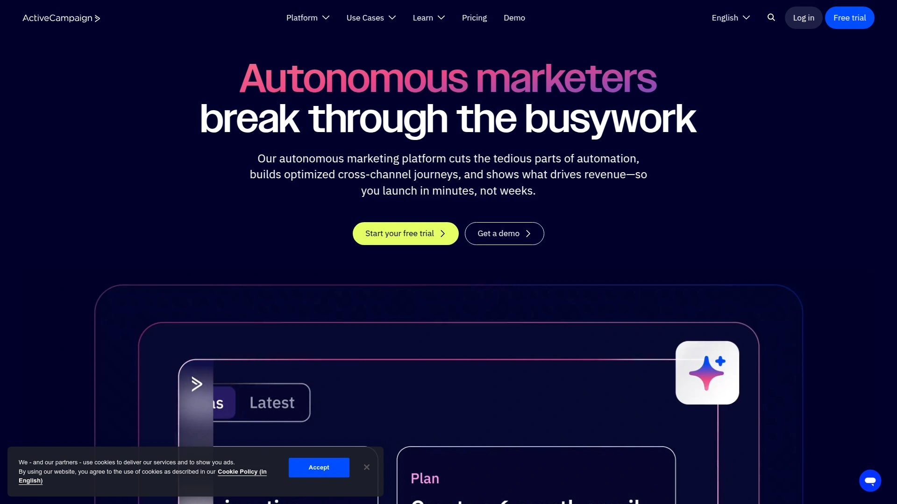

ActiveCampaign focuses on sophisticated automation workflows with conditional logic and multi-channel orchestration. The platform excels at complex drip campaigns and lead nurturing sequences. Over 926 integrations connect virtually any business software. Automation performs like enterprise platforms while remaining accessible to mid-market businesses. Email editor creates responsive HTML emails with visual, HTML, and text options. CRM and lead scoring features identify high-value prospects. SMS marketing extends reach beyond email. Site tracking monitors visitor behavior for personalized follow-ups. Transactional emails deliver order confirmations and account notifications. Omnichannel capabilities span email, SMS, chat, and social. Support includes email, live chat, and knowledge base with phone available on higher tiers. Best for businesses prioritizing marketing automation and email with chatbots as complementary channel. The depth of automation capabilities suits sophisticated marketing strategies.

## **[Flow XO](https://flowxo.com)**

Multi-platform chatbot builder with focus on automation workflows and integration capabilities.

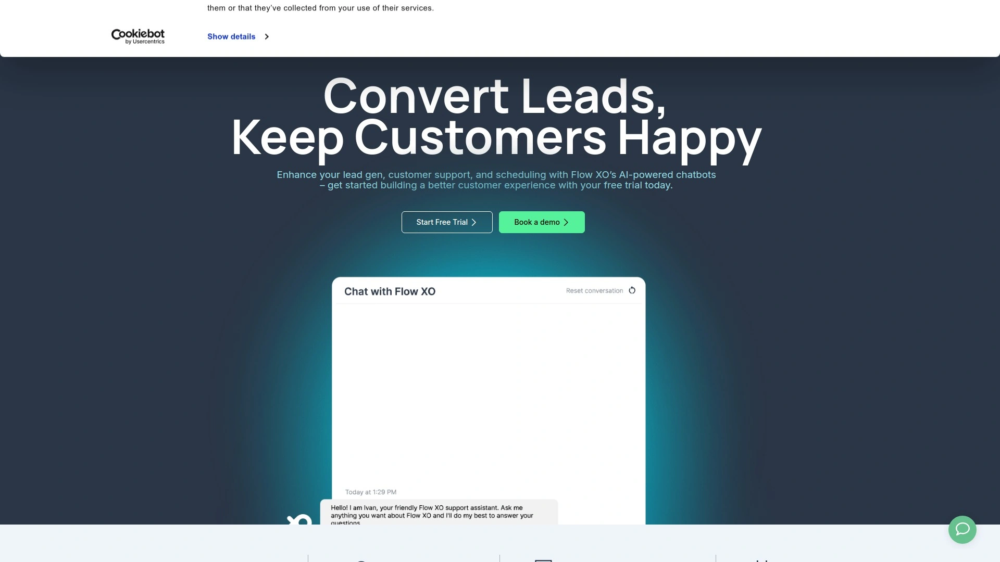

Flow XO creates chatbots deployable across website, Facebook Messenger, Slack, and Telegram. The workflow-based approach connects chatbot conversations to business processes and external systems. Integration library enables actions in other apps based on chatbot interactions. Visual builder constructs conversation flows with conditions and branching logic. The platform emphasizes connecting chat to broader automation rather than standalone conversations. API access enables custom integrations for unique requirements. Analytics track conversation paths and user engagement. Pricing scales based on bot complexity and message volume. Best for businesses wanting chatbots that trigger actions in other systems rather than just answering questions. The integration focus suits operational automation use cases.

## **[Crisp](https://crisp.chat)**

Customer messaging platform combining live chat, chatbots, knowledge base, and team collaboration tools.

Crisp provides unified inbox for customer conversations across live chat, email, Messenger, Instagram, WhatsApp, SMS, and LINE. The shared inbox keeps teams coordinated on customer communication. Chatbot builder automates common questions and qualifies visitors. Knowledge base reduces support volume by enabling self-service. CRM features track customer data and interaction history. Co-browsing lets agents see what customers see for better support. Video and screen sharing deepen engagement for complex issues. Campaign tools send targeted messages based on visitor behavior. The platform positions as affordable alternative to enterprise communication suites. Best for support teams wanting comprehensive customer communication tools in accessible package. The unified approach eliminates channel silos.

## **[Tars](https://hellotars.com)**

Conversational landing page platform turning traditional forms into engaging chatbot conversations.

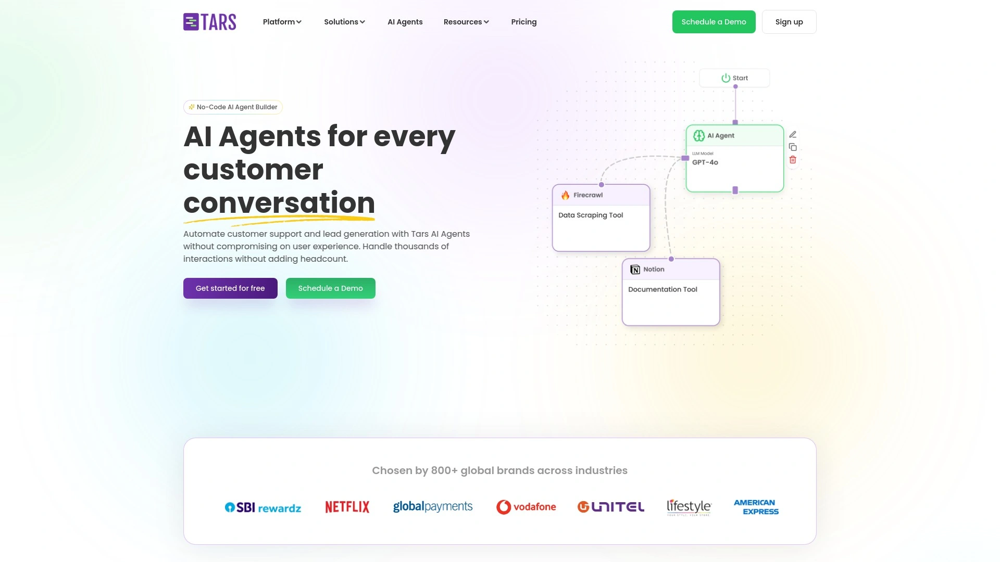

Tars specializes in replacing website forms with chatbot conversations that increase completion rates. The platform focuses specifically on conversion optimization through conversational UX. Templates provide proven conversation flows for lead generation, qualification, and appointment booking. Analytics measure completion rates and identify drop-off points. A/B testing compares conversation variations. The chatbot format increases engagement compared to static forms. Integration with marketing tools passes captured data to CRM and automation platforms. Best for businesses frustrated with low form completion rates. The conversational approach feels more engaging while collecting the same information. Works particularly well for insurance, healthcare, financial services, and other industries with complex qualification processes.

## **[ChitChatBot.ai](https://chitchatbot.ai)**

Facebook Messenger chatbot platform emphasizing conversational marketing and lead capture for social-first businesses.

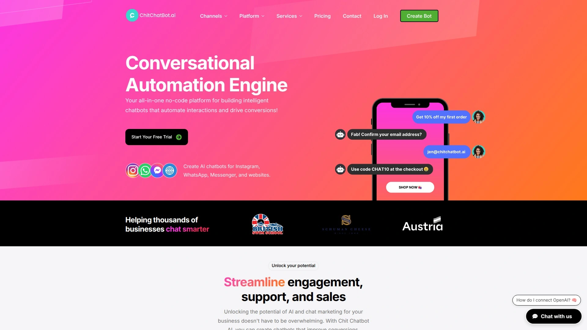

ChitChatBot.ai specializes in Facebook Messenger automation with focus on reducing acquisition costs. The platform claims ability to reduce costs by up to 9X compared to traditional channels. Over 1.3 billion active monthly Messenger users provide enormous reach potential. No-code platform creates chatbot flows for various marketing scenarios. Click-to-Messenger ad integration launches high-converting funnels automatically. Zero-party data collection through conversations enables detailed audience segmentation. Custom attributes and tags create highly specific segments for remarketing. Customer testimonials report 300% increases in sign-up rates and significant time savings. Entry points include direct messages and message ads that trigger chatbot flows. Best for businesses running Facebook ad campaigns who want to connect paid traffic directly to automated conversations. The Messenger focus means deep expertise in that specific channel.

## **[Omnichat](https://omnichat.ai)**

Omnichannel customer engagement platform with strong Facebook Messenger automation and marketing capabilities.

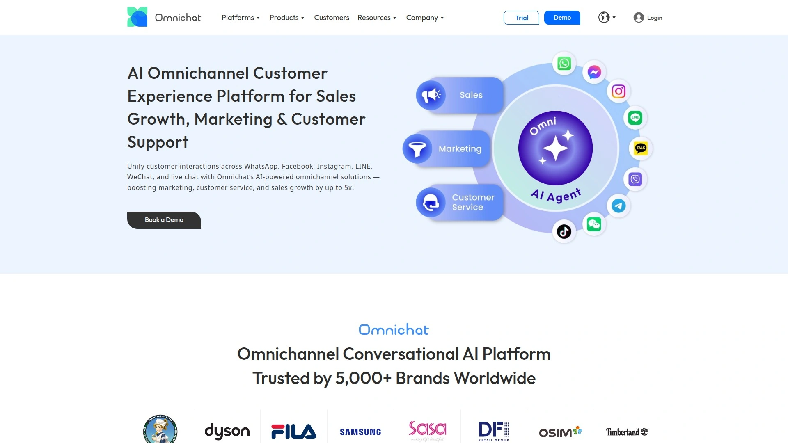

Omnichat automates Facebook Messenger replies and launches chatbot campaigns across multiple channels. Smart marketing tools drive sales through conversational commerce. Omnichannel strategy unifies customer communication regardless of entry point. The platform focuses on Asian markets particularly in e-commerce sectors. Integration with business systems enables order tracking, product recommendations, and support. Visual flow builder creates sophisticated automation sequences. Broadcasting tools send promotional messages to subscriber segments. Analytics measure campaign performance and ROI. Best for e-commerce businesses in Asian markets wanting comprehensive Messenger marketing. The regional focus means features align with local platform preferences and consumer behaviors.

## **[Wotnot](https://wotnot.io)**

No-code chatbot builder with focus on lead generation, customer support, and appointment scheduling.

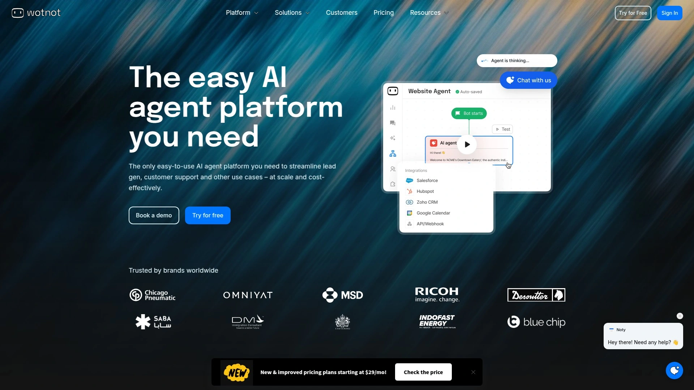

Wotnot provides visual bot builder for creating conversational experiences across multiple channels. The platform emphasizes practical business use cases like qualification, scheduling, and support. Templates accelerate deployment for common scenarios. Integration with CRM and helpdesk tools maintains data consistency. Analytics track bot performance against business objectives. Live chat handoff ensures smooth transition when human help is needed. The platform targets mid-market businesses wanting proven chatbot applications. Pricing accommodates various business sizes with transparent tiers. Best for businesses focused on specific outcomes like lead generation or appointment booking rather than exploratory chatbot experiments. The use case focus means features directly serve concrete goals.

## Frequently Asked Questions

**Can I use these chatbot platforms without any coding knowledge?**
Absolutely. Platforms like ManyChat, Chatfuel, Tidio, and Voiceflow are specifically designed for non-technical users with drag-and-drop interfaces and visual flow builders. Most people can create their first automation within 10-15 minutes using pre-built templates. Advanced features might require some learning, but the basic functionality is accessible to anyone comfortable using standard business software.

**Which platform is best for Instagram DM automation specifically?**
ManyChat leads the pack for Instagram with deep Meta integration, comment-to-DM automation, and story reply triggers that work seamlessly. The platform was built specifically for social media automation and has years of optimization for Instagram's requirements. Chatfuel is another strong Instagram option with similar capabilities. Both maintain official Meta partnerships ensuring compliance and reliability.

**Do these chatbots actually feel natural to customers or obviously robotic?**
Modern chatbots like those powered by ManyChat and Tidio's Lyro AI understand context and intent rather than just matching keywords. You control the personality and tone completely—use slang, tell jokes, or keep it professional based on your brand. The key is designing conversation flows that acknowledge when the bot can't help and smoothly hand off to humans. Customers appreciate instant responses even from bots, as long as they get resolution quickly.

## Conclusion

Finding the right chatbot platform transforms how you handle customer conversations, turning time-consuming manual responses into scalable automated systems that actually feel personal. Whether you're focused on Instagram engagement, WhatsApp customer service, or website lead generation, the tools above offer proven solutions at every budget level and technical skill range. For businesses living on social media platforms who need rock-solid Instagram, Facebook Messenger, and WhatsApp automation with the perfect balance of power and simplicity, [ManyChat](https://manychat.com) remains the go-to choice—its visual builder, Meta partnerships, and track record of delivering 80% open rates make it the natural starting point for messenger marketing success.
